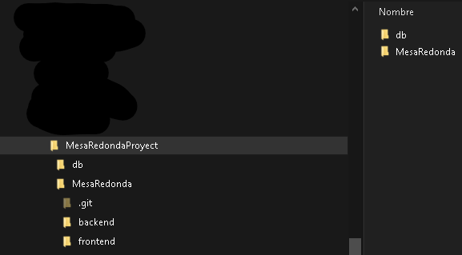

# MesaRedonda
Proyecto final del curso de Javascript de Coderhouse.

Lo siguiente es una descripción de como instalar el ambiente virtual en windows utilizando powershell.
- ubicarse dentro de la carpeta api
- una vez dentro de la carpeta api ingresar el comando "py -3 venv venv" (crear primeramente la carpeta venv si no funcionase dicho comando)
- activar el ambiente virtual utilizando el comando "venv\Scripts\activate"
- instalar flask con el comando "pip install Flask"
- instalar flask_cors con el comando "pip install -U flask-cors"
- inicializar la api con el comando "python main.py"

Es necesario tambien crear una carpeta externa al proyecto que sirva como base de datos llamada "db" y dentro de ella crear 2 archivos json: products.json y users.json ya que estos son referenciados por la api. La estructura deberia quedar de la siguiente manera:

+ CarpetaGral
	+ DB
		+ products.json
		+ users.json
	+ Proyecto
		+ Frontend
		+ Backend

esto es necesario debido a que si la carpeta "db" esta dentro del proyecto al introducir un cambio
live server identifica que hubo cambios en el proyecto y refresca la pagina, causando que no se
visualice la tienda correctamente, ya que se refresca constantemente.

en linux van a utilizarse otros comandos que estan explicitos en la documentación de flask
https://flask.palletsprojects.com/en/2.0.x/installation/
https://flask-cors.readthedocs.io/en/latest/
